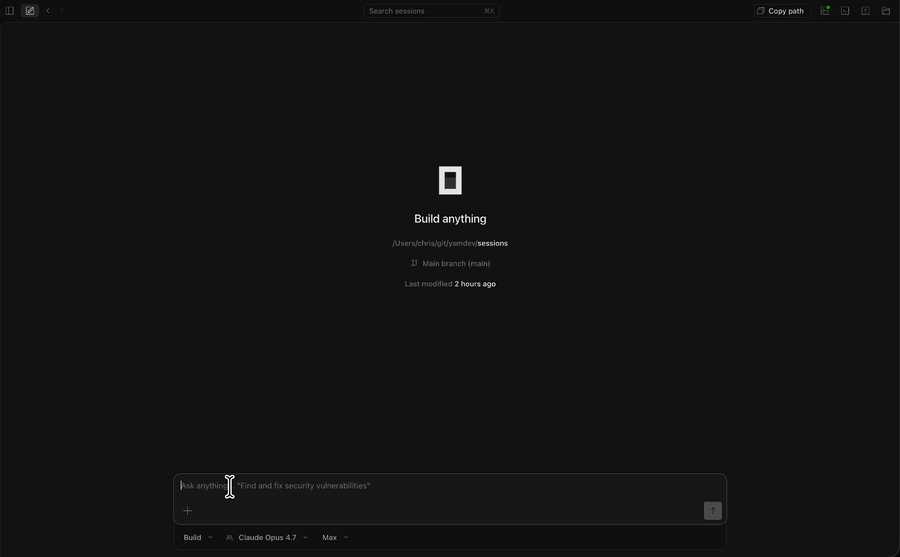

# opencode-translate


## Demo



## Why

LLMs are worse in non-English. Benchmarks confirm it on every frontier model.

- **Claude Opus 4.7 / GPT-5.5 / Gemini 3.1 Pro**: identical coding tasks scored **5/5 in English** but dropped to **0–1/5 in Arabic and Korean** ([LILT, 2025](https://lilt.com/blog/multilingual-ai-coding-gap-non-english-developers)).
- **Anthropic's own numbers**: Japanese 96.9%, Korean 96.6%, Yoruba 80.3% — English is always the baseline ([Anthropic docs](https://platform.claude.com/docs/en/build-with-claude/multilingual-support)).
- **Token tax**: Korean ~1.25×, Japanese ~1.25×, Arabic ~3× more tokens per equivalent content. Higher cost, smaller effective context.

This plugin lets you write in your language while the model works in English — best of both worlds.

> Full research write-up: [docs/why.en.md](./docs/why.en.md)

## Install

```bash
bun add -g opencode-translate
```

## Setup

Add to `~/.config/opencode/opencode.jsonc`:

```jsonc
{
  "plugin": [
    ["opencode-translate", {
      "model": "anthropic/claude-haiku-4-5", // model to use for translation
      "lang": "Korean"                        // language you speak
    }]
  ]
}
```

## Usage

Prefix any message with `$en` to activate translation for that session.

```
$en 프로젝트 루트의 package.json을 읽고 요약해줘
```

All subsequent messages in the same session are translated automatically — no need to repeat `$en`.

## Options

| Option | Type | Default | Description |
| --- | --- | --- | --- |
| `model` | string | required | Translator model in `provider/model-id` form |
| `lang` | string | required | Language you speak (e.g. `"Korean"`, `"Japanese"`) |
| `trigger` | string[] | `["$en"]` | Keywords that activate translation |
| `verbose` | boolean | `false` | Print translation logs |
