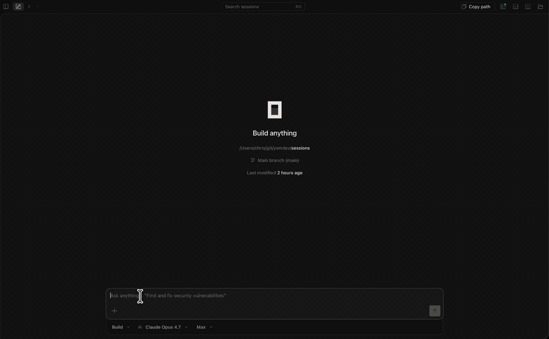

# opencode-translate

> Use opencode in your native language. LLM always hears English.


## Demo



## Why

LLMs are worse in non-English. Benchmarks confirm it on every frontier model.

- **Claude Opus 4.7 / GPT-5.5 / Gemini 3.1 Pro**: identical coding tasks scored **5/5 in English** but dropped to **0–1/5 in Arabic and Korean** ([LILT, 2025](https://lilt.com/blog/multilingual-ai-coding-gap-non-english-developers)).
- **Anthropic's own numbers**: Japanese 96.9%, Korean 96.6%, Yoruba 80.3% — English is always the baseline ([Anthropic docs](https://platform.claude.com/docs/en/build-with-claude/multilingual-support)).
- **Token tax**: Korean ~1.25×, Japanese ~1.25×, Arabic ~3× more tokens per equivalent content. Higher cost, smaller effective context.

This plugin lets you write in your language while the model works in English — best of both worlds.

> Full research write-up: [docs/why.en.md](./docs/why.en.md)

## Install

Version 2 of this plugin uses OpenCode's **v2 public plugin API**. Verified releases are OpenCode **2.0.3** and **2.0.16**.
For OpenCode v1, use `opencode-translate@1`.
Start a fresh v2 session when upgrading: v1 activation metadata and historical bilingual trailers are not migrated.

```bash
bun add -g opencode-translate
```

## Setup

Add to `~/.config/opencode/opencode.jsonc`:

```jsonc
{
  "$schema": "https://opencode.ai/config.json",
  "plugins": [
    {
      "package": "opencode-translate",
      "options": {
        "model": "openai/gpt-5.4-mini", // model to use for translation
        "variant": "minimal",          // optional model variant / thinking effort
        "lang": "Korean"               // language you speak
      }
    }
  ]
}
```

Quit and restart OpenCode after changing the plugin configuration. For a local build, run `bun install && bun run build`
and set `package` to the absolute **directory** `/path/to/opencode-translate/dist`.

## Usage

Prefix any message with `$en` to activate translation for that session.

```
$en 프로젝트 루트의 package.json을 읽고 요약해줘
```

All subsequent messages in the same session are translated automatically — no need to repeat `$en`.

- Your original message and its English translation remain visible in the transcript.
- Web composer presentation metadata is synchronized with the translated prompt, including failure notices; review-comment cards are preserved.
- The first successful `$en` prompt includes a `Translation enabled:` confirmation with the language and translator model.
- English assistant text streams normally; a translated Markdown section is appended when the text segment completes.
- Both the **terminal and web UI** display the same persisted bilingual assistant text. No UI-specific plugin is needed.
- Question forms are translated, with selected labels and custom answers converted back to English for the model.
- Translation activates only in root sessions. Its state survives plugin/server restarts.

Before model requests, the plugin removes its recorded display translations from context. It does not remove arbitrary
Markdown based on its appearance. On inbound translation failure, the transcript shows `Translation failed:` and the
error reason. The main model receives the original text without `$en` or the diagnostic; failed first-time activation
remains inactive, so retry with `$en` after fixing the error. On outbound failure, the English response is retained with
a translation-unavailable notice.

### If `$en` has no effect

`$en` is a plugin control keyword, not an instruction for the main model. If the model comments on `$en`, inbound
translation did not complete. In version 2.0.0, an inbound failure was only logged on the server and left `$en` in the
prompt, making it indistinguishable from an unloaded plugin in the transcript.

Check the active server's plugin list and configuration, including the selected project location. It must load the v2
package, not an old pinned `opencode-translate@1.x`. Also check the configured **translation** model and variant; changing
the main-chat model does not change the translator. An API-key login or OAuth connection must exist on that server.
The server log message `[opencode-translate] inbound translation failed` contains the underlying generation error.

If replies translate but your own prompt still looks untranslated in the **Web UI**, inspect the stored user message's
`text` and `metadata.displayText`. The Web UI prefers `displayText`, which versions up to 2.0.2 left at the original
composer input even when `text` contained the English translation. The prompt hook now synchronizes that presentation
field. This applies to newly admitted prompts; it does not rewrite presentation metadata on older messages.

For the Question tool, OpenCode can freeze the provider-owned question arrays. Versions up to 2.0.3 tried to mutate
those arrays and fell back to English even after obtaining a valid translation. The before-tool hook now translates a
copy and replaces `event.input`, preserving the original provider data. Already pending questions need a new tool
invocation to pick up this fix.

OpenCode 2.0.3 also normalizes the legacy `"plugin": [["package", { ...options }]]` tuple syntax; that syntax alone
does not prevent this plugin from loading. The `plugins` object form shown above is the recommended v2 format.
Make sure the configuration is a complete JSON/JSONC object, including its opening `{`.

If there is neither an activation confirmation nor a failure notice, inspect the running server's plugin state for the
same directory as the session:

```sh
opencode api v2.plugin.awaitActivation --param 'location[directory]=/absolute/path/to/project'
opencode api v2.plugin.list --param 'location[directory]=/absolute/path/to/project'
```

Find `opencode-translate`, check `source.version` and `state.status`, and inspect `state.error` if setup failed. If the UI
uses a remote or explicitly selected server, pass `--server` with that same server URL. A client version or a globally
installed npm version alone does not establish what the session's server has loaded.

## Authentication

Connect the translation model's provider in **OpenCode itself**. Translation uses the public `ctx.generate.text()` API,
with a `ctx.session.generate()` fallback for providers that require an OpenCode session. OpenCode owns provider
selection, model variants, API keys, SQLite credentials, and OAuth refresh/persistence.
The plugin does not read `auth.json`/`auth-v2.json`, query the credential database, or maintain separate tokens.
Provider and OAuth support for the translation model is the support available in your OpenCode installation.

Verified on OpenCode 2.0.3 using the host's saved credentials:

| Translation model | Result |
| --- | --- |
| `openai/gpt-5.6-luna` | Inbound, outbound, and follow-up translation passed through stateless generation with ChatGPT OAuth. |
| `opencode/muse-spark-1.3-contributor-free` | Passed through the session-aware fallback described below. |
| `opencode-go/gpt-5.6-luna` | Passed through the same session-aware fallback (Go's `x-opencode-session` rejection, not Zen's free-tier one). |
| `anthropic/claude-sonnet-5` with `@henadev/opencode-anthropic-auth@0.2.0` | Works as the main chat model, but not as the translator in this release: its auth plugin depends on session HTTP hooks that stateless generation skips. |

Anthropic translation succeeded in a session-aware experiment, but the automatic fallback in this release is limited
to the explicit OpenCode session-metadata rejections described below. It does not retry generic authentication
errors through another path.

### OpenCode session-metadata-only translation models

`ctx.generate.text()` omits the session request metadata every Console tier requires (Zen `opencode` and Go
`opencode-go`, and presumably any tier Console adds later). The plugin recognizes this **upfront, from the
configured provider ID** -- `isSessionOnlyProvider()` -- and routes those providers straight to session-aware
generation without ever attempting the stateless call. This is deliberate: Console has phrased the rejection
differently by tier and release (the free Zen tier: `OpenCode's free tier can only be used in/from within
OpenCode.`; the paid Go tier: `Request is missing x-opencode-session and cannot be routed efficiently.`), and a
provider-ID check that's known before the request is sent can't be broken by wording changes on Console's side --
unlike matching the rejection message, which has already needed two updates.

Matching the rejection message (`isSessionMetadataRequired()`) still exists as a safety net for providers
`isSessionOnlyProvider()` doesn't recognize: on that specific rejection, mid-translation, the plugin switches the
same way. Both paths converge on public session-aware generation using a reusable **Translation helper** session
for the configured model and location. The helper may appear in the session list. Translation prompts are
transient: they do not append messages to either the helper or your chat, and each generation receives only the
current translation prompt plus OpenCode's system instructions and tool definitions. The helper ID survives
plugin/server restarts. Other authentication or model-selection failures still report their original error.

This was verified with `opencode/muse-spark-1.3-contributor-free` (Zen) and `opencode-go/gpt-5.6-luna` (Go): normal
session generation succeeds on both, `ctx.generate.text()` lacks the session request metadata either provider
accepts, and with the provider ID recognized upfront, the plugin never attempts the stateless call in the first
place for either one.

Tool definitions are deliberately kept in the helper session's requests. Console's free tier reads a request with an
emptied tool list as non-agent traffic and rejects it with the same `free tier can only be used within OpenCode`
error, even when the request otherwise carries correct session headers -- confirmed by comparing requests with and
without tool definitions against the real `opencode.ai/zen` backend. This is harmless for translation: the plugin's
session-generate call never runs a tool loop, so the model cannot actually execute anything even though it can see
the schemas.

## Inline reply support

V2 has no `experimental.text.complete` hook or public display-only message append operation. Inline translations use
`session.hook("http.response", ...)` with adapters for these **main-chat response protocols**:

| Protocol | Recognized endpoint | Support |
| --- | --- | --- |
| OpenAI Responses, including Codex | `…/responses` | SSE text deltas and final snapshots |
| OpenAI Chat Completions and compatible providers | `…/chat/completions` | SSE text choices |
| Anthropic Messages | `…/messages` | SSE text blocks |
| Gemini / Vertex Gemini | `…:streamGenerateContent` | SSE non-thinking text |

Unknown endpoints, non-SSE responses, and binary protocols such as Bedrock Converse pass through unchanged with a server
log message. They still support inbound/question translation when the translation model is available through OpenCode.
Reasoning, tool calls, images, and other non-text outputs are not translated.

**Transport:** Replies are translated in the HTTP response stream. OpenCode 2.0.3 routed sessions through HTTP by
itself whenever HTTP hooks were registered; later releases stream WebSocket-default providers (OpenAI, including
Codex, and xAI) over a session WebSocket regardless, and those replies never reach HTTP hooks. The plugin therefore
sets `transport: "http"` on every provider configured for WebSocket. Loading it disables the session WebSocket fast
path in its location, including sessions that have not activated `$en`.
Translations add latency at text-completion boundaries and use additional model requests. Their usage is separate from
the primary model's reported token counts.

**AI SDK providers:** Models served through an AI SDK client are translated from the model's text stream parts
instead, through `aisdk.hook("language")`. This covers provider plugins that send requests with their own `fetch`,
which never reaches OpenCode's HTTP hooks, such as `oc-codex-multi-auth` 6.24.0 for `openai`, in either plugin
order. To identify the session, a `model.request` hook tags primary requests with an internal
`x-opencode-translate-session` header, which is stripped from AI SDK calls and HTTP requests before they are sent.

## Development and verification

```sh
bun install
bun run check:ci
bun run typecheck
bun run knip
bun test
bun run build
bun run test:package

# Requires OpenCode 2.0.16: native OpenAI plus multi-auth-style AI SDK providers,
# both plugin orders, duplicate prevention, and English-only follow-up context.
OPENCODE_BINARY=/path/to/opencode bun run test:openai

# Requires Node 24 and an OpenCode v2 binary; uses an isolated server and fake provider.
OPENCODE_BINARY=/path/to/opencode bun run test:host

# Exercise a registry-installed package through OpenCode's actual package loader.
OPENCODE_BINARY=/path/to/opencode OPENCODE_TRANSLATE_PACKAGE=opencode-translate@latest bun run test:host

# Verify OpenCode's normalization of legacy plugin tuples as well.
OPENCODE_BINARY=/path/to/opencode OPENCODE_TRANSLATE_LEGACY_CONFIG=1 bun run test:host

# Verify providers that support ordinary stateless generation.
OPENCODE_BINARY=/path/to/opencode OPENCODE_TRANSLATE_REQUIRE_SESSION=0 bun run test:host
```

Tests include OpenCode's actual native protocol parsers. The real-host smoke test loads the built plugin, creates and
rotates a test credential in an isolated SQLite database, checks bilingual persisted messages and English-only model
requests, and restarts the server to verify recovery. It does not use your live server, credentials, or paid models.
It also executes the real Question tool, checks translated form fields, submits selected options and a Korean custom
answer, and verifies that the next model request contains the original English questions and English answers.
CI covers both configuration formats and both generation paths. The publish workflow tests the candidate before
publishing, then installs the exact version from npm in OpenCode before creating its GitHub release.
The OpenAI compatibility smoke runs before and after publishing on 2.0.16. Its fake auth plugin reproduces
`oc-codex-multi-auth` 6.24.0's SDK/fetch/model wrapping without live credentials or external model requests.

The old `opencode2 v0.0.0-dev-18322` binary does not pass this migration's host smoke test. Use the verified 2.0.3 release
rather than assuming that any binary named `opencode2` exposes the current plugin API.

## Options

| Option | Type | Default | Description |
| --- | --- | --- | --- |
| `model` | string | required | Translator model in `provider/model-id` form |
| `variant` | string | optional | Translator model variant / thinking effort (for example, `"minimal"`, `"high"`, or `"max"`) |
| `lang` | string | required | Language you speak (e.g. `"Korean"`, `"Japanese"`) |
| `trigger` | string[] | `["$en"]` | Keywords that activate translation |
| `verbose` | boolean | `false` | Print translation logs |
